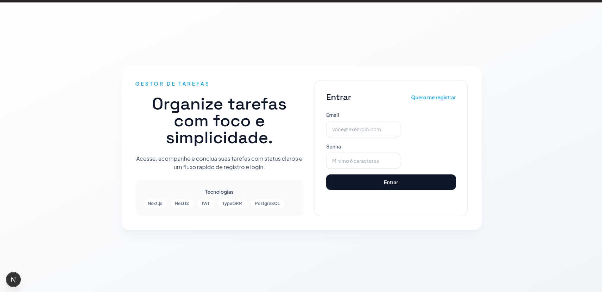
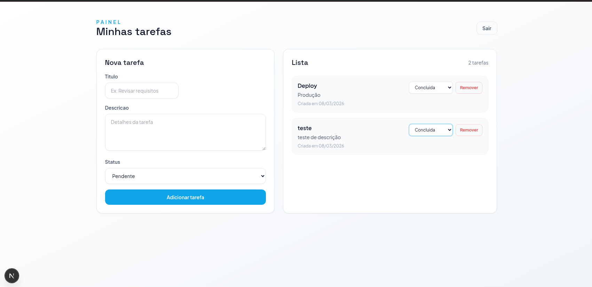

# TaskNest

Aplicacao fullstack de gerenciamento de tarefas desenvolvida com **Next.js + NestJS + PostgreSQL**.

## Funcionalidades implementadas

- Autenticacao com JWT:
  - Registro (`POST /auth/register`)
  - Login (`POST /auth/login`)
- Rotas protegidas no backend com `JwtAuthGuard`
- Rotas protegidas no frontend com `middleware.ts` (redirecionamento entre `/` e `/tasks`)
- CRUD de tarefas por usuario autenticado:
  - Criar tarefa
  - Listar tarefas do usuario
  - Atualizar tarefa (incluindo status)
  - Remover tarefa
- Campos da tarefa:
  - `title`
  - `description` (opcional)
  - `status` (`pendente`, `em progresso`, `concluida`)
  - `createdAt` (automatica)
  - `completedAt` (atualizada automaticamente quando status = `concluida`)
- Interface com:
  - Tela de login/registro
  - Tela de gerenciamento de tarefas
  - Modal de confirmacao para exclusao
  - Layout responsivo

## Tecnologias

- Frontend: Next.js 15, React 19, TypeScript, Tailwind CSS
- Backend: NestJS 10, TypeORM, class-validator, Passport JWT
- Banco: PostgreSQL 16 (Docker)

## Como rodar o projeto

## 1) Banco de dados (Docker)

```bash
docker compose up -d
```

## 2) Backend (NestJS)

```bash
cd backend
cp .env.example .env
npm install
npm run start:dev
```

Backend em: `http://localhost:3001`

## 3) Frontend (Next.js)

```bash
cd frontend
cp .env.example .env
npm install
npm run dev
```

Frontend em: `http://localhost:3000`

## Screenshots

### Login e Registro (`/`)



### Tarefas (`/tasks`)



## Endpoints

- `POST /auth/register`
- `POST /auth/login`
- `GET /tasks`
- `POST /tasks`
- `PATCH /tasks/:id`
- `DELETE /tasks/:id`

## Estrutura

- `backend/src/auth`: autenticacao e emissao de token JWT
- `backend/src/users`: entidade e servico de usuarios
- `backend/src/tasks`: entidade, DTOs, controller e servico de tarefas
- `backend/src/common`: guard e decorator compartilhados
- `frontend/src/app/page.tsx`: login/registro
- `frontend/src/app/tasks/page.tsx`: painel de tarefas
- `frontend/src/components/confirm-modal.tsx`: modal de confirmacao

## Observacoes

- O backend esta com `synchronize: true` no TypeORM para facilitar ambiente local.
- Cada usuario acessa apenas as proprias tarefas.
